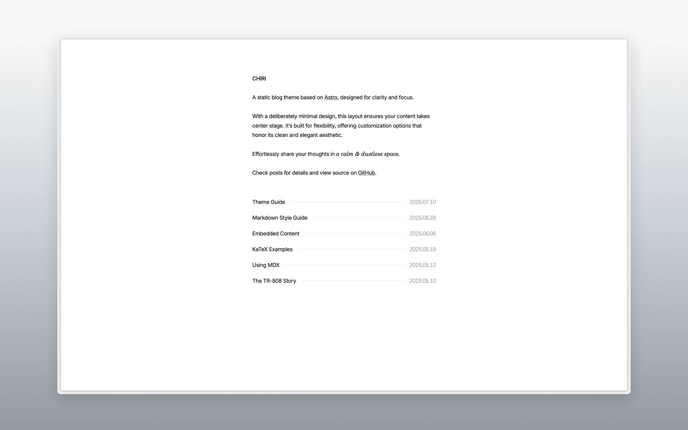

# Chiri 🌸




Chiri is a minimal blog theme built with [Astro](https://astro.build), offering customization options while preserving its clean aesthetic.

Check the [demo](https://astro-chiri.netlify.app/) for more details.

## Features

- [x] Build with Astro
- [x] Responsive
- [x] Light / Dark mode
- [x] MDX
- [x] KaTeX
- [x] Sitemap
- [x] OpenGraph
- [x] RSS
- [ ] Pagination

## Getting Started

1. [Fork](https://github.com/the3ash/astro-chiri/fork) this repository, or use this template to [create a new repository](https://github.com/new?template_name=astro-chiri&template_owner=the3ash).

2. Run the following commands:

   ```bash
   git clone <your-repo-url>

   cd <your-repo-name>

   pnpm install

   pnpm dev
   ```

3. Edit `src/config.ts` and `src/content/about/about.md` to your liking.

4. Use `pnpm new <title>` to create new posts, or add your posts to `src/content/posts`.

5. You need to set adapter as follows before deploying to Netlify, Vercel, or other platforms, but you can set `linkCard` to `false` in `src/config.ts` to skip this step:
   - **Netlify**: `pnpm add @astrojs/netlify` and add `adapter: netlify()` in `astro.config.ts`.
   - **Vercel**: `pnpm add @astrojs/vercel` and add `adapter: vercel()` in `astro.config.ts`.
   - **Cloudflare Pages**: `pnpm add @astrojs/cloudflare` and add `adapter: cloudflare()` in `astro.config.ts`.
   - **Static (e.g. GitHub Pages)**: `pnpm add @astrojs/static` and add `adapter: static()` in `astro.config.ts`.
   - Refer to [Astro Deployment Guides](https://docs.astro.build/en/guides/deploy/) for more details.

&emsp;[](https://app.netlify.com/start) [](https://vercel.com/new) [](https://pages.cloudflare.com/start)

## Commands

- `pnpm new <title>` - Create a new post (use `_title` for drafts)
- `pnpm update-theme` - Update the theme to the latest version

## References

- https://paco.me/
- https://benji.org/
- https://shud.in/
- https://retypeset.radishzz.cc/

## License

MIT
