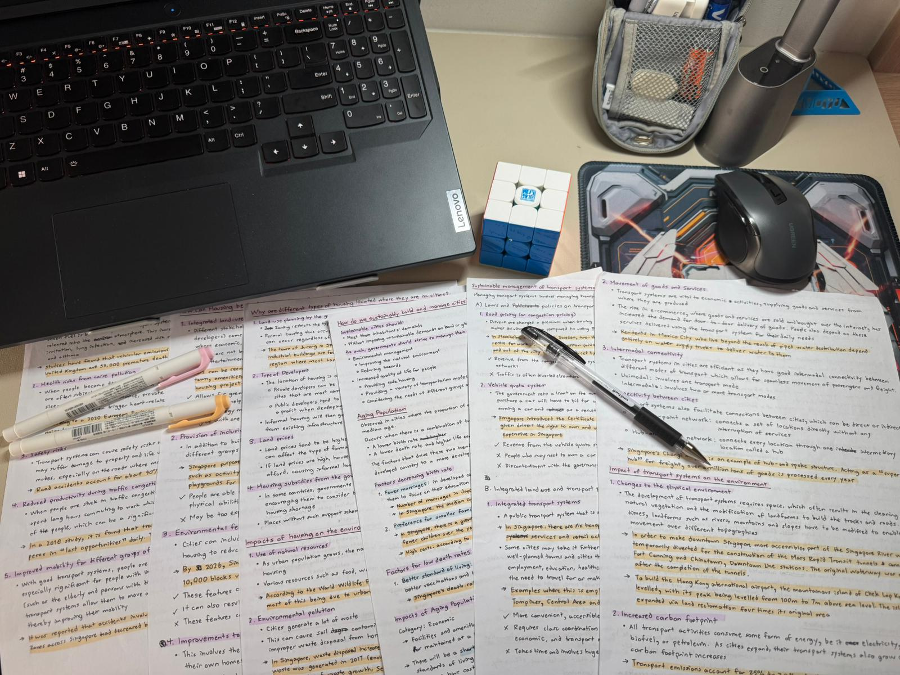

I. HATE. CRAMMING.

Cramming is the act of studying intensively at the last minute before an exam. It often means skimming notes instead of actively practicing or recalling information—a strategy that rarely works. More often than not, it comes at the cost of sleep, squeezing in “just one more hour” at the expense of rest.